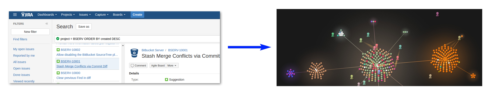

Jira → Gource converter
=======================

[Jira][JIRA] is issue tracking software application, developed by Atlassian.

[Gource][Gource-homepage] is a version control visualization tool.

This script downloads history of issues from a Jira server via [REST
API][JIRA-REST-API] and converts it into [custom format][Gource-custom-format],
allowing to visualize Jira history using Gource.

Usage
-----

### Input

*See example of a configuration in file `config.sample.py`.*

The script's input is provided through a `config.py` file.  You need to provide:

* URL to the Jira server
* Jira login to use with REST API
* `projects` map with config for every Jira projects to download
* Every project config consists of:
  * Two integers `min_key` and `max_key` – bounds of the issue keys to download
  * Optional `skip_filter` – a function which takes a changelog entry and returns
    a boolean – whether or not the changelog entry should be skipped in the
    output.  Use `None`, if you do not want to define a `skip_filter`.
  * `skip_dates` – a set of dates, which you wish to skip in the output.
    Suggestions for dates to skip:

      * workflow transition – when all tickets have one field updated
      * big assignee transition – when a lot of tickets are reassigned

    These kinds of changes touch a lot of tickets and thus make for a bad
    visualization of Jira history.  Use `set()` (empty set) if you do not want to
    skip any changelog entries.

  * Optional `sections_extension` – a function to extend (or completely change)
    the default "fake folder" path for tickets.
  * By default, script only downloads ticket's summary and changelog.  To make
    an interesting `sections_extension` function, you might need some other
    fields of the ticket.  This can be done by specifying these fields in config
    variable `extra_fields` as a list of strings.

Some helper functions are defined in `configlib.py` to make writing logic for
`config.py` easier.  All of these function operate on some JSON objects, like
issues and issues' changelog entries.  See [official Atlassian
documentation][JIRA-REST-API] for more details.

### Running

With `config.py` in place, launch jira-gource:

    $ python generate_gource.py

When the script starts downloading the tickets, it will prompt the user
for their Jira password to authenticate with the Jira server.

**If you are using Jira Cloud:**

- You will receive a 401 code if you try to just authenticate with a password.
You can easily use an API token instead.
- Go to [Manage Tokens][Manage-Tokens] and create a new API token.
- Copy the token to a local file because you
will not have access to it after creating it.
- When prompted for a password, use the API token instead.
- Reference to the removal can be found in
[this Atlassian blog post.][Atlassian-Blog]

### Output

* `gource-input-<PROJECT>.txt` – Jira history converted to the custom format
  used by Gource.  This file can be used by Gource directly, for example:

      $ gource gource-input-JRASERVER.txt

  For more details about using Gource, see [documentation][Gource-github]
  on github.

* `names.txt` – list of Jira users who appeared in the history of downloaded
  tickets.  This list can be used to download the photos to use with Gource's
  `--user-image-dir` option.
* `json_dump/<ID>-tickets.json` – cache of downloaded tickets.  Delete
  this file if you want to re-download the tickets on the next launch.
* `missing-tickets.txt`―list of tickets, for which Jira has returned
  [HTTP response code 404](https://en.wikipedia.org/wiki/HTTP_404), which
  would be skipped on the next launch of the script.

Jira tickets do not have any inherent structure similar to a codebase in a
filesystem.  Script attempts to generate a pseudo folder structure from colon
separated prefixes in tickets summaries.  Issue type is used to create the file
extensions in the generated history.  Different file extensions result in
different colors of nodes in the Gource visualization.  For example: a "Task"
ticket PROJECT-42 with summary "System: Component: implement feature" will be
represented by `PROJECT/System/Component/PROJECT-42.Task` in the generated
Gource input.

### Alternative way to build hierarchy via fixVersion

By default hierarchy of ticket (path) builded by **_jira components_** value and **_section_** (part of summary split by `:`, _details [here](https://github.com/rybak/jira-gource/blob/00acf0c78265eb9492339185e710359264e5e2d5/history_converter.py#L25C5-L28C61)_)

But what if we want to see history project through it evalution by release/fix version? So then [check this](FIX-VERSION-HIERARCHY-CONFIG.md)

### Dependencies and compatibility

* [requests](http://python-requests.org) library – to talk to a Jira server
  via REST API
* jira-gource uses Python 3 features and is not Python 2 compatible.
* jira-gource has only been tested with [Jira version 7.1.6][JIRA-REST-API],
  but is probably compatible with all 7.\* versions.

Contributing
------------

Feel free to open an issue or to submit a pull request in any of the
repositories.  Any feature-requests, suggestions, and questions are welcome.

Mirrors
-------

* https://github.com/rybak/jira-gource
* https://bitbucket.org/andreyrybak/jira-gource
* https://gitlab.com/andrybak/jira-gource

TODO
----

* Automate ticket ranges in `config.py` by checking max ticket key via JQL
* Download avatars directly from Jira server using URL of the following form
  `<JIRA-SERVER>/jira/secure/useravatar?size=large&ownerId=fred`
* Flip boolean logic from `skip_filter` to `changelog_predicate`, to correspond
  to the first parameter of Python's `filter` builtin.
* Retire `skip_dates`, as `skip_filter` is much more versatile.  In the sample
  `skip_dates` logic could be included into `skip_filter`.
* Rename `sections_extension` to something sensible.
* Clean up and document the code.
* Write release notes
* Release version 1.0
* Add name mapping/filtering

[Gource-homepage]: http://gource.io
[Gource-github]: https://github.com/acaudwell/Gource
[Gource-custom-format]: https://github.com/acaudwell/Gource/wiki/Custom-Log-Format
[JIRA]: https://www.atlassian.com/software/jira
[JIRA-REST-API]: https://docs.atlassian.com/software/jira/docs/api/REST/7.1.6
[Atlassian-Blog]: https://developer.atlassian.com/cloud/jira/platform/deprecation-notice-basic-auth-and-cookie-based-auth/
[Manage-Tokens]: https://id.atlassian.com/manage/api-tokens
